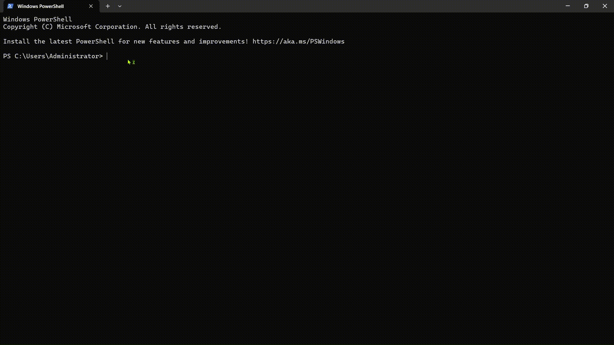

# devdebug

A fast, smart CLI tool that analyzes log files and surfaces real errors instantly.
Supports plain text and JSON logs, custom patterns, real-time watching, and multi-format export.

## Install

Download the latest binary from [Releases](https://github.com/rkbharti/devdebug_CLI/releases):

| Platform | Binary                       |
| -------- | ---------------------------- |
| Windows  | `devdebug-windows-amd64.exe` |
| Linux    | `devdebug-linux-amd64`       |
| macOS    | `devdebug-darwin-amd64`      |

Or build from source (requires Go 1.22+):

    git clone https://github.com/rkbharti/devdebug_CLI.git
    cd devdebug_CLI
    go build -o devdebug .

## Commands

    devdebug analyze <file|folder>   Scan log file or folder for errors
    devdebug compare <old> <new>     Diff two log files
    devdebug init                    Generate starter devdebug.yaml
    devdebug version                 Print version info

## Analyze Flags

    --type    Filter by error type: panic, timeout, error
    --format  Export report: json or md
    --follow  Watch file in real-time (tail mode)
    --quiet   No output, only exit code (CI use)
    --since   Show errors after time  e.g. 2026-04-19T10:00:00
    --until   Show errors before time e.g. 2026-04-19T18:00:00

## Custom Patterns (devdebug.yaml)

Run `devdebug init` to generate a starter config, then edit it:

    patterns:
      - name: "Auth Failure"
        keyword: "unauthorized"

      - name: "5xx HTTP Error"
        regex: "HTTP [5][0-9]{2}"

      - name: "Retry Exhausted"
        regex: "(?i)failed after [0-9]+ retr"

Place `devdebug.yaml` in the same directory where you run the command.

## Examples

    # analyze a log file
    devdebug analyze app.log

    # filter only panic errors
    devdebug analyze app.log --type panic

    # export as JSON report
    devdebug analyze app.log --format json

    # watch a live log file
    devdebug analyze app.log --follow

    # compare two log files
    devdebug compare old.log new.log

    # use in CI pipelines (exit 1 if errors found)
    devdebug analyze app.log --quiet

## CI Usage

    - name: Check logs for errors
      run: devdebug analyze app.log --quiet

Exit code `0` = no errors. Exit code `1` = errors found.

## Tech Stack

- Language : Go 1.22
- CLI : cobra
- Styling : charmbracelet/lipgloss
- Testing : Go standard testing — 102 tests
- CI/CD : GitHub Actions

## License

MIT
